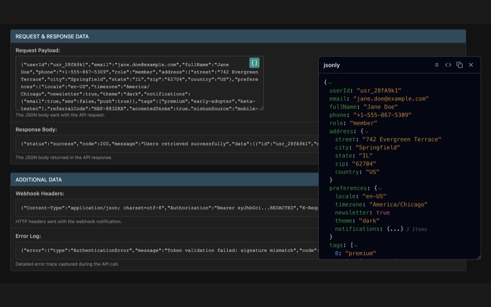
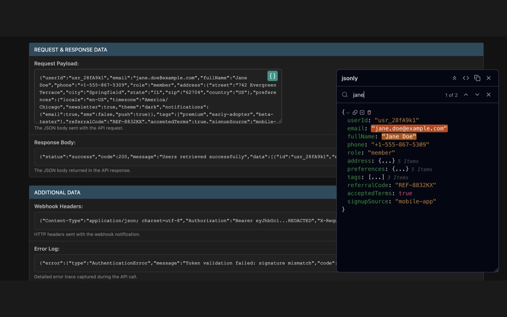

<p align="center">
  
</p>

# jsonly

jsonly is a browser extension (Chrome and Firefox) that automatically detects JSON on a webpage, opens a floating window to pretty-print, search, collapse nodes, edit values, and copy - all without leaving the page.

Open source. No tracking, no data collection, no servers. Everything runs locally in your browser.

| Formatted JSON viewer | Search & highlight |
|---|---|
|  |  |

---

## Building from source

### Quick build

From a clean checkout, run the all-in-one build script:

```bash
./build.sh
```

Or equivalently:

```bash
pnpm install --frozen-lockfile
pnpm package
```

This installs dependencies, builds both extensions, and produces `chrome.zip` and `firefox.zip` at the repo root. Requires Node.js 20+ and pnpm.

If you only need one browser:

```bash
pnpm package:chrome     # → chrome.zip
pnpm package:firefox    # → firefox.zip
```

### Build output

After a successful build:

- `apps/chrome/dist/`  — unpacked Chrome extension (loadable via `chrome://extensions` → "Load unpacked")
- `apps/firefox/dist/` — unpacked Firefox extension (loadable via `about:debugging` → "Load Temporary Add-on…")
- `chrome.zip` and `firefox.zip` — store submission artifacts

<details>
<summary>Store reviewers — reproducing the exact submission artifacts</summary>

These steps reproduce the exact `chrome.zip` and `firefox.zip` artifacts submitted to the Chrome Web Store and addons.mozilla.org.

### Operating system

Any Unix-like OS with a POSIX shell and the `zip` utility will work. The extension was built and tested on:

- **macOS 26 (Darwin, arm64)** — primary development/build environment
- Linux (Ubuntu 22.04+) and Windows (via WSL2) are also supported

`zip` is preinstalled on macOS and most Linux distributions. On Debian/Ubuntu: `sudo apt-get install zip`.

### Installing Node.js

Download an installer from https://nodejs.org/ (LTS is fine), or with `nvm`:

```bash
# Install nvm (https://github.com/nvm-sh/nvm), then:
nvm install 24
nvm use 24
node --version   # should print v24.x.x (or v20.x+)
```

### Installing pnpm

The project pins pnpm 10.33.0 via the `"packageManager"` field in `package.json`. The recommended installation is via Corepack (bundled with Node.js 16.10+):

```bash
corepack enable
corepack prepare pnpm@10.33.0 --activate
pnpm --version   # should print 10.33.0
```

Alternatively, install globally with npm:

```bash
npm install -g pnpm@10.33.0
```

### Step-by-step build

```bash
# 1. Install all workspace dependencies from the locked manifest.
#    --frozen-lockfile guarantees the installed versions match pnpm-lock.yaml
#    exactly, making the build reproducible.
pnpm install --frozen-lockfile

# 2. Build every workspace (runs `vite build` for chrome, firefox, and
#    extension-ui via turborepo). Outputs land in apps/<browser>/dist/.
pnpm build

# 3. Package the unpacked builds into zip artifacts at the repo root.
pnpm package:chrome     # → chrome.zip
pnpm package:firefox    # → firefox.zip
```

</details>

---

## Development

```bash
pnpm install              # install workspace dependencies
pnpm dev                  # watch-build all packages
pnpm test                 # run the extension-ui test suite (vitest)
pnpm lint                 # oxlint
pnpm format               # oxfmt
```

To try the extension locally during development:

- **Chrome**: open `chrome://extensions`, enable Developer mode, click "Load unpacked", and select `apps/chrome/dist`.
- **Firefox**: open `about:debugging#/runtime/this-firefox`, click "Load Temporary Add-on…", and select any file inside `apps/firefox/dist` (e.g. `manifest.json`).

## License

See [LICENSE](./LICENSE).
